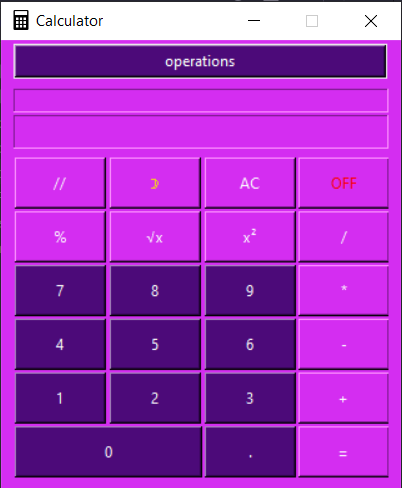

# Calculator

Language:

* [RU](#ru_doc)
* [EN](#en_doc)

### Документация

***

Перед вами калькулятор умеющий выполнять разные арифметические операции.
Также он обрабатывает ошибку деления на ноль и ограничивает количество запятых
на экране: не более одной запятой. Есть выбор цветовых тем, а также
сохранение последних арифметических вычислений. При запуске калькулятора история
арифметических вычислений очищается.

Арифметические операции, которые он умеет выпонять:

* Сложение(+)
* Вычитание(-)
* Умножение(*)
* Деление(/)
* Целочисленное деление(//)
* Деление по остатку(%)
* Возведение в квадрат числа
* Квадратный корень из числа

Цветовые темы:

* Тёмная
* Светлая
* Розовая
* Оранжевая
* Жёлтая
* Синяя
* Зелёная
* Фиолетовая

[Как выглядят темы можно посмотреть снизу.](#color_themes)

__Спасибо за внимание!__

### Documentation

***

Here is a calculator that can perform various arithmetic operations.
It also handles divide-by-zero error and limits the number of commas
on screen: no more than one comma. There is a choice of color themes as well
saving the last arithmetic calculations. When you start the calculator history
arithmetic calculation is cleared.

Arithmetic operations that he can perform:

* Addition(+)
* Subtraction(-)
* Multiplication(*)
* Деление(/)
* Integer division(//)
* Division by remainder(%)
* Squaring a number
* The square root of a number

Color themes:

* Dark mode
* Light mode
* Rose mode
* Orange mode
* Yellow mode
* Sky mode
* Green mode
* Purple mode

[You can see how the topics look like below.](#color_themes)

__Thank you for your attention!__

> ### Color theme:
>
>
> 
> 
> 
> 
> 
> 
> 

[Up | Вверх](#anchor)